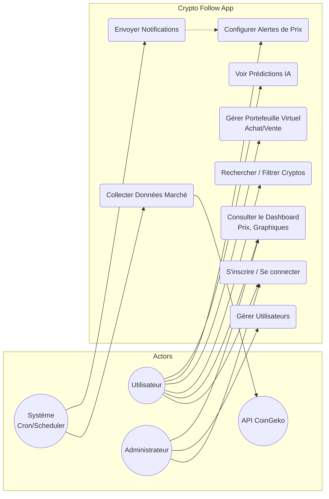
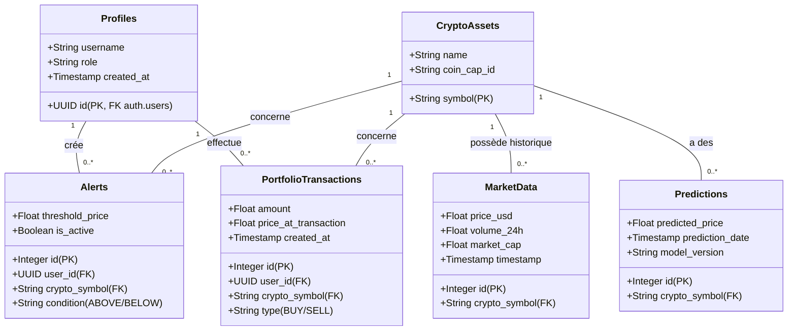
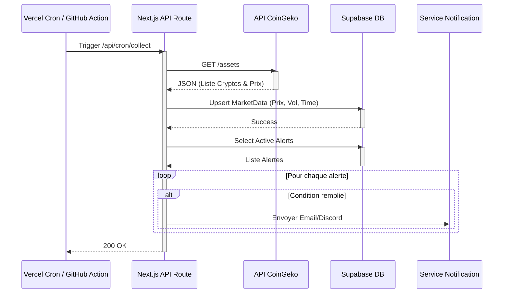
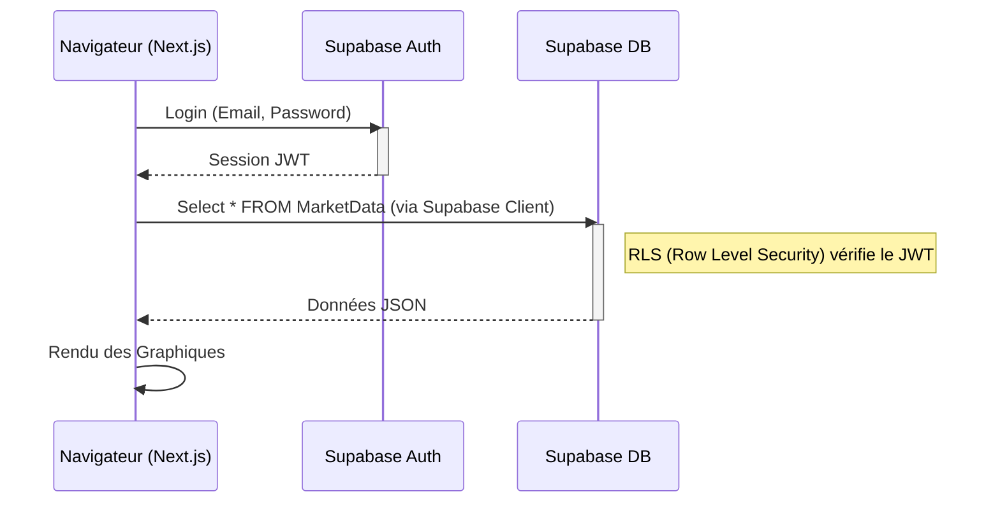
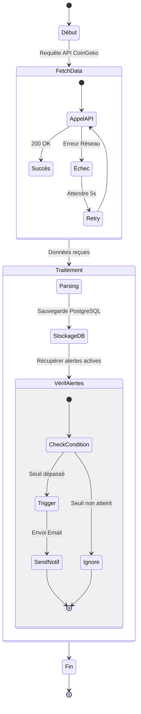
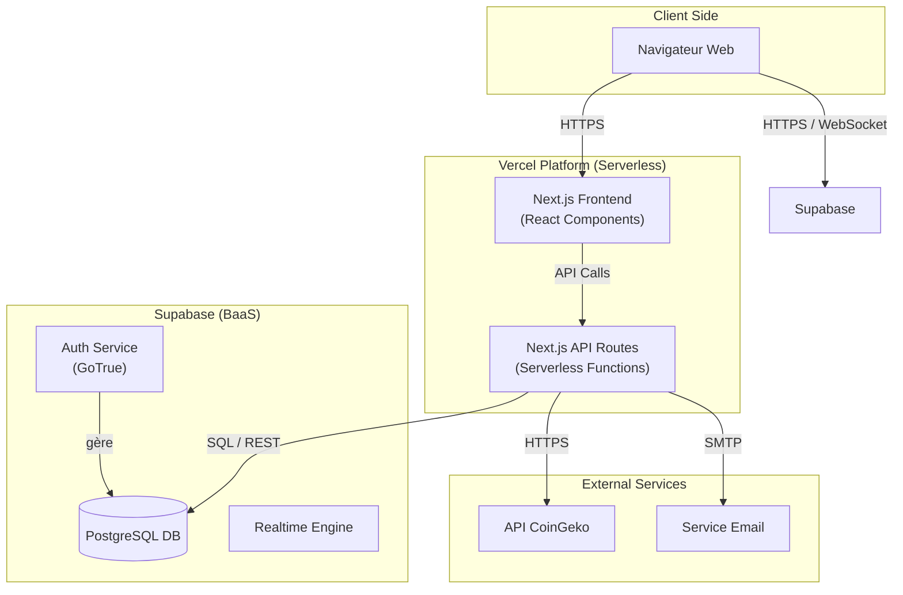

# Diagrammes Mermaid - Crypto Follow
Réalisé sur https://mermaid.live
## 1. Use Case Diagram

## 2. Class Diagram (Supabase)

## 3. Sequence Diagrams
### Collecte de Données

### Connexion Utilisateur

## 4. Activity Diagram

## 5. Deployment Diagram

